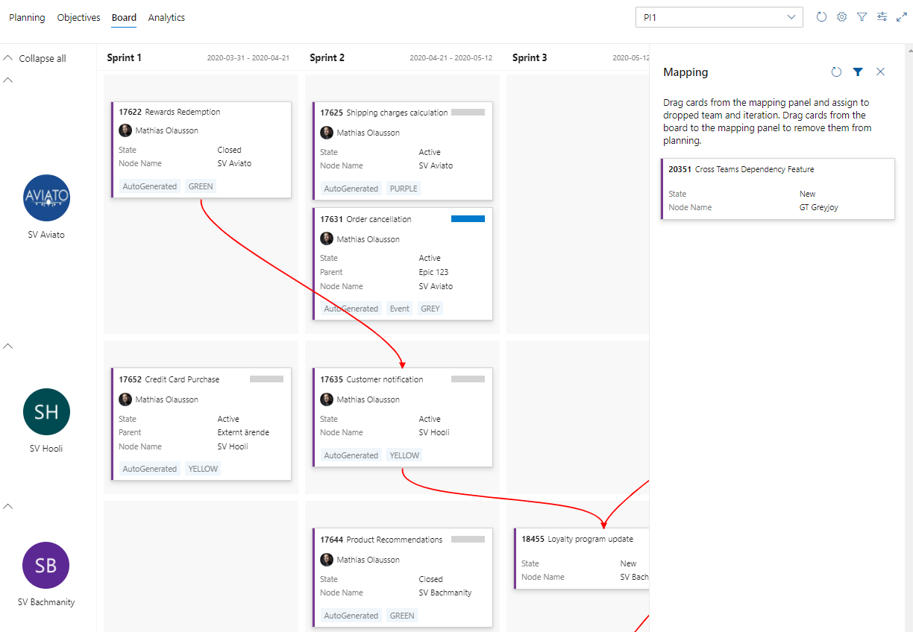
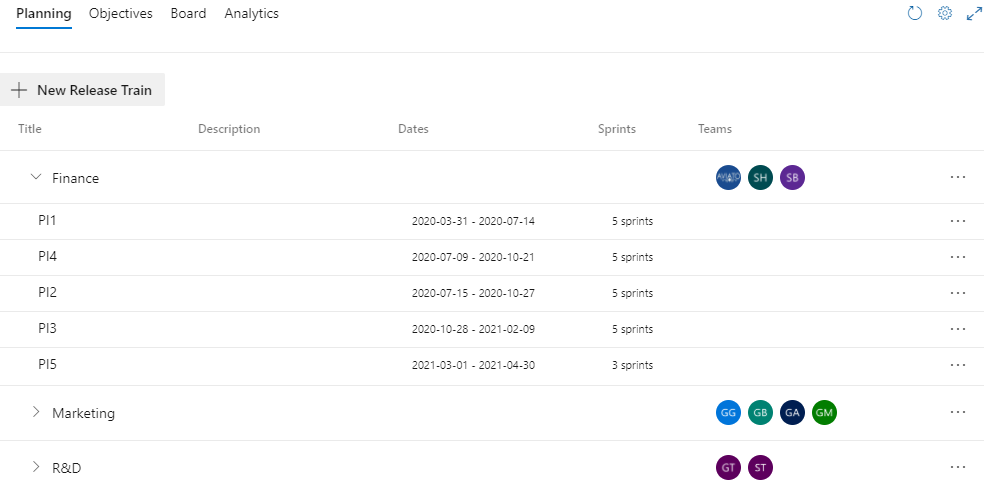
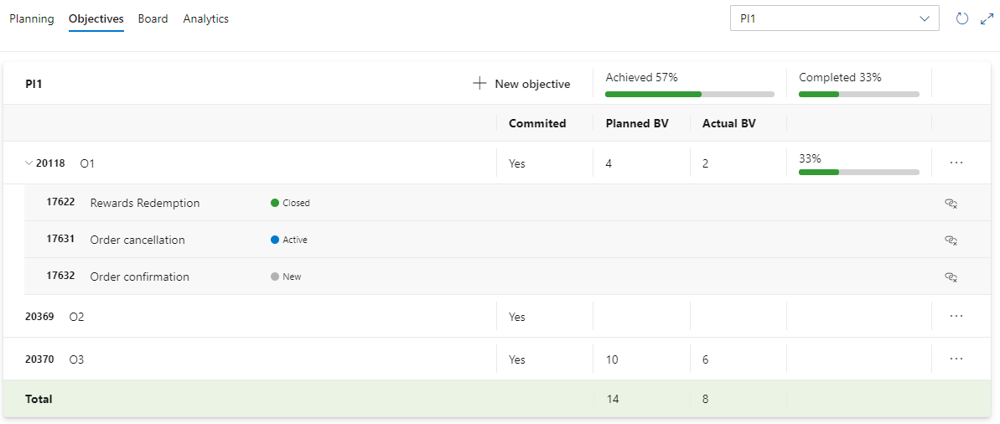
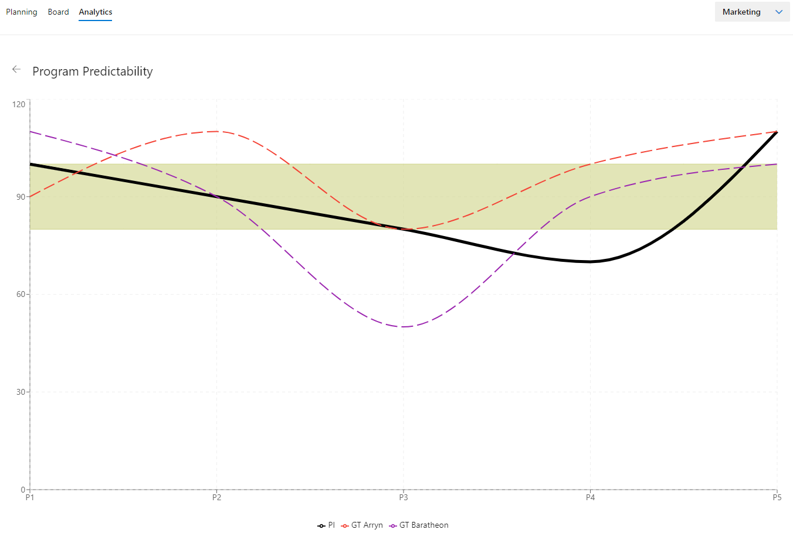

# @Scale - SAFe for Azure DevOps

With the @Scale extension your Azure DevOps project will be enriched to include artifacts and tools from scaled agile ideas, such as the Scaled Agile Framework, SAFe.

In this repository we work on features and issues related to the @Scale Azure DevOps extension.

# Get @Scale
The @Scale extension is hosted for installation on the [Azure DevOps Marketplace](https://marketplace.visualstudio.com/items?itemName=solidify.solidify-scale).

# Feedback
* [Request a new feature](https://github.com/solidify/scale/issues/new?template=feature_request.md)
* [Report an issue](https://github.com/solidify/scale/issues/new?template=bug_report.md)

# Releases
Check out [Releases](https://github.com/solidify/scale/releases) to the right here in the repo for the information about the updates we're shipping.

# About @Scale
## Dependency management using a program board

Working together at scale requires increased visibility into what others are doing. @Scale adds an interactice program board to make documenting and sharing that information easier.

  * **Quickly document planning**. The program board lets you easily add features directly to the board or map them from an existing backlog.
  * **Share increment overview**. With a digital program board anyone can look at the result from the increment planning.
  * **Visualize dependencies**. The program board shows dependencies between features and it's really easy to add new by dropping cards on each other to make a connection. 

## Planning

When working at scale repeatable tasks can easily become significant chores, so in the spirit of lean principles we want to automate what we can to remove waste. 

  * **Definition of context**. In @Scale you define who works together so relevant information can be kept in focus for the teams. In SAFe we define the agile release trains, ARTs, as the logical unit of connecting who works on what when.
  * **Order teams**. Set the order or the teams to match how you want them displayed on the board.
  * **Add dependent teams**. Dependent teams can be added to the ART if you want to track dependecies between delivery teams and shared teams.
  * **Automating creation of Program Increments and Sprints**. Tools should support and not be in the way, in agile there are a lot of recurring tasks that @Scale tries to automate. 

## Objectives

Goal setting is key to keep focus on the most important things. In @Scale you can set goals at PI level or per team by using Objectives. Set the planned business value (BV) when planning the increment and follow up during the execution. Use 

  * **Documenting PI and Team PI Objectives**. An important part of measuring performance and delivery precision is to set objectives for the PIs and then measure the outcome. 
  * **Measure achievement and delivery**. Use business value to measure outcome and monitor progress using Feature completion by linking objectives to features.

## Analytics

Quick insights into project status is essential, @Scale shows metrics that matters in your SAFe planning, including

  * **Program Predictability**. The chart show actual business value achieved compared to planned business value.
  * **Solution Train Predictability**. Sums the PI level performance metric as the average outcome for each release train.

## Process configuration

Alignment of agile teams is important when working at scale, but it can be time-consuming to maintain. @Scale extends Azure DevOps with process enhancements to make it easer to get started and keep going. In @Scale we've also added tooling for additional planning concepts and artifacts introduced by SAFe, such as release trains, program increments and objectives.

  * **Custom Azure DevOps SAFe process template**. We bring a SAFe process template to Azure DevOps so you don't have to spend time coming up with one on your own. 
  * **Automating configuration of Azure DevOps projects**. It should be easy to get started so we provide a guided configuration process that automatically adds the artfacts used in the SAFe frameword, for instance release trains, program increments and objectives.
  
