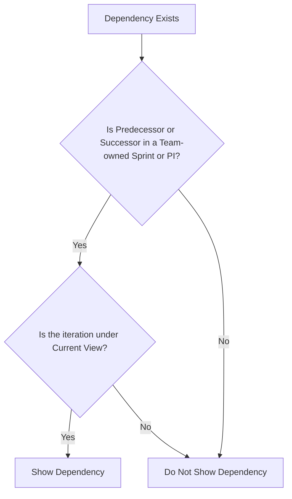

# Dependency Hub User Guide

## Introduction

The Dependency Hub in @Scale improves dependency management with a comprehensive, user-friendly interface. It provides real-time visibility into dependency statuses, helping teams stay on track.

## Key Features

### Request Layer
- Send and manage dependency requests to team members.
- Accept or decline requests to clarify responsibilities.

### Dashboard Overview
- Real-time updates on dependency statuses.
- Visualize which dependencies are accepted, declined, or pending.

### Status Tracking
- Monitor dependencies through their lifecycle.
- Track statuses such as in progress, planned, delivered, or late.

## Using the Dependency Hub

### Sending a Dependency Request
1. Navigate to the Dependency Hub.
2. Click on "New Dependency Request."
3. Fill in the details and send the request.
   1. **Title** - Title of the dependency request
   2. **Requested by** - Which team is requesting this dependency?
   3. **Depends on** - Which team is solving or delivering this dependency
   4. **Requested for** - For what is this dependency needed to? (Select an item in the requested by teams backlog
   5. **Need By** - In what iteration does this need to be delivered?
   6. **Description** - Describe what this dependency request is about
      
   


### Managing Dependencies
- View and manage all requests on the dashboard.
- Track accepted dependencies through their lifecycle.
- Reassign or re-evaluate declined dependencies.

### Tracking Progress
- Dependencies are color-coded based on their status.
- Hover over a dependency for detailed information.

### Example Dashboard


## Getting Started

### Enabling & configuring the Dependency Hub
1. Go to the new menu option "Depdendencies"
2. Go through the guide
3. Configure the workflow for dependencies


There are 3 different options when working with dependencies. We recommend choosing option 1 which is a predefined work item type that will get configured.
1. **Predefined Work item type** - @Scale will configure a new work item type in your process called "Dependency Request" 
2. **Custom work item type** - If you already have a similar request item in your process, you can select your own item which will act as a dependency request in @scale.
3. **No configuration** - This will just show a list of your dependencies (Predecessor & successors), this limits the functionality and removes the request capabilties of @Scale

### General Functions

| **Setting** | **Function** |
|-------------|--------------|
| Internal team dependencies | Toggle visibility of dependencies within the same team where both the predecessor & successor exist in the same team |
| Filtering | Filter on any of the columns through the filter button|


## Workflow Examples & Board Recommendations

Dependency Requests can be shown in the board, but here are some general recommendations of how you can mittigate a cluttered board!

### Workflow of Requests

The Dependency Hub categorizes dependency requests into three states:

1. **Pending** 
   - The dependency request has not been accepted or declined yet.
   
2. **Accepted** 
   - When a request is accepted, you need to link it to the actual item solving the dependency. This action closes the request and associates it with the solving item.
   
   
   
3. **Declined** 
   - If a request is declined, provide a reason for the decline. The request will be marked as "Removed" and the reason will be recorded in the Dependency Hub.
   
   

### Board Example & Recommendations

During planning, after estimating delivery times for features, your board might look like this:


To create dependencies, go to the Dependency Hub and submit a request. For example, if your team needs new pipelines for a feature, you can request them from the innovation team:


Once you've added the dependency request, the board will show the request as pending:


When the innovation team reviews the request, they can accept or decline it. In this case, if they accept it, they will create a user story to address the dependency:


After acceptance, the board displays both the request and the solving item. The request will be marked as "Accepted" and moved to the closed items category:


To avoid clutter, set rules to exclude accepted dependency requests from the board:


This ensures that only unhandled dependency requests and dependencies are displayed during team planning:


## What is Required to Show a Dependency in the Dependency Hub

### General Rule
A dependency will appear in the **Dependency Hub** as long as **at least one of the links (Predecessor or Successor) is tied to a PI or sprint owned by the team**. This ensures that teams can easily track relevant dependencies across different time periods and iterations.

### Key Points to Remember
1. **Visibility Criteria**:
   - **Either the Predecessor or the Successor must exist in a sprint or PI that is currently in your view.**
   - Dependencies remain visible even if one link occurs outside the current period.

2. **Team Ownership**:
   - The team must own the sprint or PI where at least one part of the dependency exists.
   - Dependencies not tied to any sprint or PI owned by the team will not be displayed.

3. **Works Across Time Periods**:
   - If part of the dependency occurs before or after the current period but the other part is within a visible sprint or PI, the dependency will still be shown.
   - This allows users to track dependencies even when they span multiple PIs or sprints.

---

### Example Scenarios

1. **Dependency Within the Current Period**:
   - If a dependency involves Sprint 1 and Sprint 2 in PI2:
     - It will appear because both sprints are within the current period.

2. **Dependency Spanning Multiple PIs**:
   - If a predecessor exists in PI1 and a successor exists in Sprint 1 of PI2:
     - It will appear because Sprint 1 is within the current view.

3. **Dependency with Future Work**:
   - If the successor exists in PI3 but the predecessor exists in Sprint 2 of PI2:
     - It will appear because Sprint 2 is within the current view.

---

### Visual Guide

Below is a flowchart to clarify the process for determining if a dependency will appear:



## How Does the Dependency Flow Work?

The dependency flow in the Dependency Hub is designed to streamline the process of managing and resolving cross-team dependencies. This section explains how a dependency request moves through the system and how its state evolves based on team actions.

---

### Dependency Flow

1. **New Dependency Request**:
   - A team creates a new dependency request and assigns it to another team.
   - The request is added to the recipient team's Dependency Hub in the **"New"** state.

2. **Team Response**:
   - The recipient team must **accept** or **decline** the dependency request.

3. **Accepted Dependency**:
   - When a request is accepted:
     - The **Dependency Request is marked as "Accepted"**.
     - - It moves to the **"Closed"** category state.
     - A new **Dependency** is created and replaces the request.
     - The new dependency becomes the **Predecessor** in the system.
     - The original request is **Related** to the new dependency for tracking purposes.

4. **Declined Dependency**:
   - When a request is declined:
     - The **Dependency Request is marked as "Declined"**.
     - It moves to the **"Removed"** category state.
     - A reason for the decline can be documented for visibility and transparency.

5. **Pending Dependency**:
   - Until a request is acted upon, it remains in the **"New"** (Pending) state.

---

### Visual Guide to Dependency Flow

```mermaid
graph TD
    A[New Dependency Request] --> B{Did the Team Take Action?}
    B --> |Accept| C[Close Request]
    C --> D[Create New Dependency]
    D --> E[Dependency Becomes Predecessor]
    C --> F[Link Request to Dependency]
    B --> |Decline| G[Mark Request as Declined]
    G --> H[Move to 'Removed' State]
    B --> |No Action| I[Keep in 'New' State]


